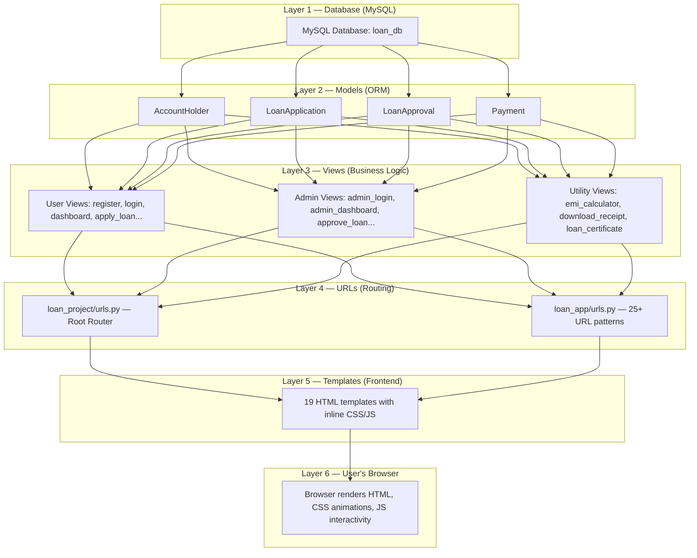
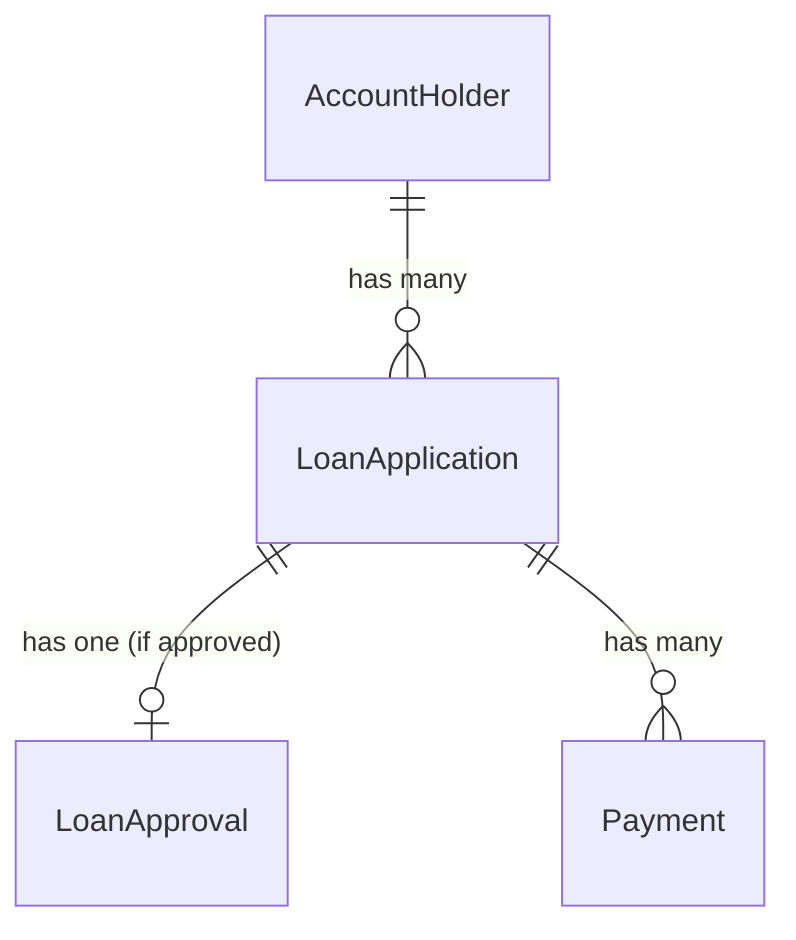
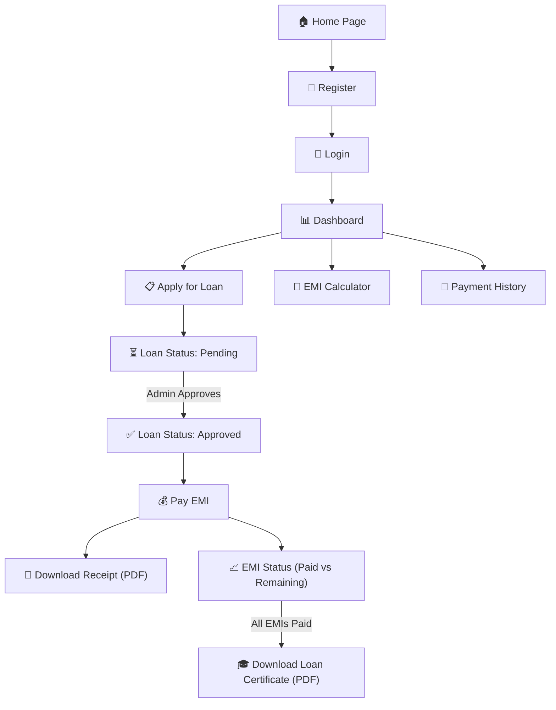
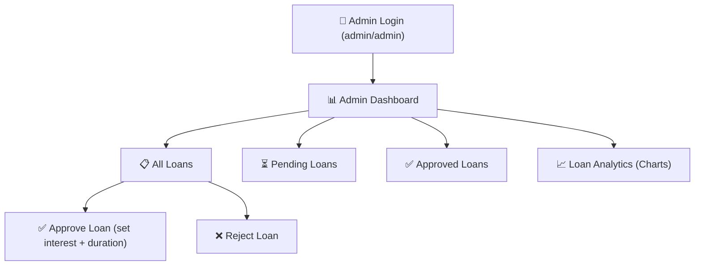

# 🏦 EasyLoan Finance — Complete Project Explanation (Bottom → Top)

This is a **Loan Management System** web application where users can register, apply for loans, pay EMIs, and download receipts — while admins can approve/reject loans and view analytics.

---

## 1. Tools & Technologies Used

| Technology | Purpose | Where Used |
|---|---|---|
| **Python 3.x** | Core programming language | All backend logic |
| **Django 5.2.9** | Web framework (MVT pattern) | Project structure, ORM, routing, sessions |
| **MySQL** | Relational database | Stores all user, loan, payment data |
| **HTML5** | Page structure | All 19 template files |
| **CSS3** | Styling & animations | Inline `<style>` blocks in each template |
| **JavaScript** | Client-side interactivity | Counter animations, EMI calculator, Chart.js |
| **ReportLab** | PDF generation library | EMI receipts & loan closure certificates |
| **Chart.js** (CDN) | Data visualization | Loan analytics charts |
| **Google Fonts** | Typography (Inter, Outfit) | All pages for modern look |

> [!NOTE]
> The project uses **Django's MVT (Model-View-Template)** pattern — the Python equivalent of MVC. Django handles HTTP, sessions, ORM, and URL routing out of the box.

---

## 2. Project Architecture (Bottom → Top)



---

## 3. Layer 1 — Database (MySQL)

**File:** [settings.py](file:///c:/Users/vishw/OneDrive/Desktop/Project/loan_project-main/loan_project/settings.py#L77-L86)

```python
DATABASES = {
    'default': {
        'ENGINE': 'django.db.backends.mysql',
        'NAME': 'loan_db',
        'USER': 'root',
        'PASSWORD': 'Tiger',
        'HOST': 'localhost',
        'PORT': '3306',
    }
}
```

- Uses **MySQL** running on `localhost:3306`
- Database name: `loan_db`
- Django's ORM converts Python model classes into SQL tables automatically via `python manage.py migrate`

---

## 4. Layer 2 — Models (Database Tables)

**File:** [models.py](file:///c:/Users/vishw/OneDrive/Desktop/Project/loan_project-main/loan_app/models.py)

There are **4 models** (= 4 database tables):

### 4.1 `AccountHolder` (User Registration)
Lines 4–47 — Stores everything about a registered user:

| Field Group | Fields |
|---|---|
| **Personal Info** | `full_name`, `email`, `phone`, `date_of_birth` |
| **Address** | `address`, `city`, `state`, `pincode` |
| **Account** | `username`, `password` (stored as plain text) |
| **Images** | `profile_image`, `signature` (uploaded to `/media/`) |
| **ID Proofs** | `aadhaar_number`, `aadhaar_image`, `pan_number`, `pan_image` |
| **Bank Details** | `bank_name`, `account_number`, `ifsc_code` |
| **Employment** | `occupation`, `company_name`, `monthly_salary`, `experience` |

### 4.2 `LoanApplication` (Loan Requests)
Lines 49–68 — Created when a user applies for a loan:

| Field | Purpose |
|---|---|
| `user` | **ForeignKey** → links to `AccountHolder` |
| `loan_type` | Personal, Home, Education, Business |
| `loan_amount` | Requested amount |
| `interest_rate` | Set later during approval |
| `loan_duration` | Duration in months |
| `purpose` | Why the user needs the loan |
| `status` | `Pending` → `Approved` or `Rejected` |

### 4.3 `LoanApproval` (Approved Loan Details)
Lines 71–88 — Created only when admin approves a loan:

| Field | Purpose |
|---|---|
| `loan` | **ForeignKey** → links to `LoanApplication` |
| `approved_amount` | Final approved amount |
| `interest_rate` | Interest rate set by admin |
| `emi` | Calculated EMI amount |
| `duration` | EMI duration in months |

### 4.4 `Payment` (EMI Payments)
Lines 91–104 — Created each time user pays an EMI:

| Field | Purpose |
|---|---|
| `loan` | **ForeignKey** → links to `LoanApplication` |
| `amount` | Amount paid |
| `payment_method` | UPI, Net Banking, etc. |
| `emi_number` | Which EMI this is (1st, 2nd, 3rd…) |

### Relationships Diagram



---

## 5. Layer 3 — Views (Business Logic)

**File:** [views.py](file:///c:/Users/vishw/OneDrive/Desktop/Project/loan_project-main/loan_app/views.py) — 678 lines of Python

Views are **functions** that receive an HTTP request, process data, and return an HTTP response (usually an HTML page). Here's every view explained:

### 5.1 User-Facing Views

| View Function | URL | What It Does |
|---|---|---|
| [home](file:///c:/Users/vishw/OneDrive/Desktop/Project/loan_project-main/loan_app/views.py#L3-L4) | `/` | Renders the landing page |
| [register](file:///c:/Users/vishw/OneDrive/Desktop/Project/loan_project-main/loan_app/views.py#L10-L81) | `/register/` | **GET**: shows registration form. **POST**: collects 20+ fields, creates `AccountHolder`, redirects to login |
| [login](file:///c:/Users/vishw/OneDrive/Desktop/Project/loan_project-main/loan_app/views.py#L84-L102) | `/login/` | Checks username/password against DB, stores `user_id` in **session** |
| [dashboard](file:///c:/Users/vishw/OneDrive/Desktop/Project/loan_project-main/loan_app/views.py#L105-L114) | `/dashboard/` | Shows user's personal dashboard (requires login via session check) |
| [logout](file:///c:/Users/vishw/OneDrive/Desktop/Project/loan_project-main/loan_app/views.py#L117-L121) | `/logout/` | Deletes session and redirects to login |
| [apply_loan](file:///c:/Users/vishw/OneDrive/Desktop/Project/loan_project-main/loan_app/views.py#L124-L152) | `/apply-loan/` | Form to submit a new loan application |
| [loan_status](file:///c:/Users/vishw/OneDrive/Desktop/Project/loan_project-main/loan_app/views.py#L155-L164) | `/loan-status/` | Shows all loans the logged-in user has applied for |
| [loan_details](file:///c:/Users/vishw/OneDrive/Desktop/Project/loan_project-main/loan_app/views.py#L279-L284) | `/loan-details/<id>/` | Shows details of a specific loan + approval info |
| [emi_payment](file:///c:/Users/vishw/OneDrive/Desktop/Project/loan_project-main/loan_app/views.py#L287-L298) | `/emi-payment/` | Lists approved loans that user can pay EMIs for |
| [pay_emi](file:///c:/Users/vishw/OneDrive/Desktop/Project/loan_project-main/loan_app/views.py#L300-L326) | `/pay-emi/<id>` | Form to pay next EMI for a specific loan |
| [payment_history](file:///c:/Users/vishw/OneDrive/Desktop/Project/loan_project-main/loan_app/views.py#L328-L336) | `/payment-history/` | Shows all past EMI payments |
| [emi_status](file:///c:/Users/vishw/OneDrive/Desktop/Project/loan_project-main/loan_app/views.py#L338-L365) | `/emi-status/` | Shows total vs paid vs remaining EMIs for each loan |
| [emi_calculator](file:///c:/Users/vishw/OneDrive/Desktop/Project/loan_project-main/loan_app/views.py#L273-L274) | `/emi-calculator/` | Client-side EMI calculator (no backend processing) |

### 5.2 Admin Views

| View Function | URL | What It Does |
|---|---|---|
| [admin_login](file:///c:/Users/vishw/OneDrive/Desktop/Project/loan_project-main/loan_app/views.py#L167-L180) | `/admin-login/` | Hardcoded credentials: `admin`/`admin`. Sets `session['admin'] = True` |
| [admin_dashboard](file:///c:/Users/vishw/OneDrive/Desktop/Project/loan_project-main/loan_app/views.py#L183-L201) | `/admin-dashboard/` | Shows counts: total users, total loans, pending, approved |
| [all_loans](file:///c:/Users/vishw/OneDrive/Desktop/Project/loan_project-main/loan_app/views.py#L211-L218) | `/all-loans/` | Lists every loan application in the system |
| [approve_loan](file:///c:/Users/vishw/OneDrive/Desktop/Project/loan_project-main/loan_app/views.py#L226-L261) | `/approve-loan/<id>` | Admin sets interest rate & duration → **EMI is auto-calculated** using the formula, creates `LoanApproval`, changes status to "Approved" |
| [reject_loan](file:///c:/Users/vishw/OneDrive/Desktop/Project/loan_project-main/loan_app/views.py#L263-L270) | `/reject-loan/<id>` | Changes loan status to "Rejected" |
| [pending_loans](file:///c:/Users/vishw/OneDrive/Desktop/Project/loan_project-main/loan_app/views.py#L665-L667) | `/pending-loans/` | Filtered list — only pending loans |
| [approved_loans](file:///c:/Users/vishw/OneDrive/Desktop/Project/loan_project-main/loan_app/views.py#L673-L675) | `/approved-loans/` | Filtered list — only approved loans |
| [loan_analytics](file:///c:/Users/vishw/OneDrive/Desktop/Project/loan_project-main/loan_app/views.py#L617-L659) | `/loan-analytics/` | Aggregates data for charts (monthly loans, amounts) |

### 5.3 PDF Generation Views

| View Function | What It Generates |
|---|---|
| [download_receipt](file:///c:/Users/vishw/OneDrive/Desktop/Project/loan_project-main/loan_app/views.py#L379-L450) | **EMI Payment Receipt PDF** — uses ReportLab to draw a formatted receipt with customer details, payment info, and company branding |
| [loan_certificate](file:///c:/Users/vishw/OneDrive/Desktop/Project/loan_project-main/loan_app/views.py#L472-L603) | **Loan Closure Certificate PDF** — only generates if ALL EMIs are paid. Creates a formal certificate with a table and signature section |

### EMI Calculation Formula

Used in [approve_loan](file:///c:/Users/vishw/OneDrive/Desktop/Project/loan_project-main/loan_app/views.py#L236-L240):

```
EMI = [P × R × (1+R)^N] / [(1+R)^N - 1]

Where:
  P = Principal (loan amount)
  R = Monthly interest rate (annual_rate / 12 / 100)
  N = Duration in months
```

---

## 6. Layer 4 — URL Routing

### 6.1 Root URLs
**File:** [loan_project/urls.py](file:///c:/Users/vishw/OneDrive/Desktop/Project/loan_project-main/loan_project/urls.py)

```python
urlpatterns = [
    path('admin/', admin.site.urls),        # Django's built-in admin panel
    path('', include('loan_app.urls')),      # All app URLs
]
# + serves media files (uploaded images) in debug mode
```

### 6.2 App URLs
**File:** [loan_app/urls.py](file:///c:/Users/vishw/OneDrive/Desktop/Project/loan_project-main/loan_app/urls.py) — 25+ URL patterns

Maps every URL like `/register/`, `/apply-loan/`, `/approve-loan/5` to its corresponding view function.

> [!TIP]
> URLs with `<int:id>` (like `/approve-loan/<int:id>`) are **dynamic** — the `id` number is passed as an argument to the view function to identify a specific loan or payment.

---

## 7. Layer 5 — Templates (Frontend)

**Directory:** [templates/](file:///c:/Users/vishw/OneDrive/Desktop/Project/loan_project-main/templates) — 19 HTML files

Each template is a **self-contained HTML page** with inline CSS and JavaScript (no shared base template or external CSS files).

### Template Categories

#### Landing & Auth
| Template | Purpose |
|---|---|
| [home.html](file:///c:/Users/vishw/OneDrive/Desktop/Project/loan_project-main/templates/home.html) | Landing page with hero section, stats counter animation, feature cards |
| [register.html](file:///c:/Users/vishw/OneDrive/Desktop/Project/loan_project-main/templates/register.html) | Multi-section registration form (personal, address, bank, employment, ID proofs) |
| [login.html](file:///c:/Users/vishw/OneDrive/Desktop/Project/loan_project-main/templates/login.html) | User login form |

#### User Dashboard
| Template | Purpose |
|---|---|
| [dashboard.html](file:///c:/Users/vishw/OneDrive/Desktop/Project/loan_project-main/templates/dashboard.html) | User's main dashboard with navigation to all features |
| [apply_loan.html](file:///c:/Users/vishw/OneDrive/Desktop/Project/loan_project-main/templates/apply_loan.html) | Loan application form |
| [loan_status.html](file:///c:/Users/vishw/OneDrive/Desktop/Project/loan_project-main/templates/loan_status.html) | Table of user's loan applications with status badges |
| [loan_details.html](file:///c:/Users/vishw/OneDrive/Desktop/Project/loan_project-main/templates/loan_details.html) | Detailed view of a specific loan |
| [emi_calculator.html](file:///c:/Users/vishw/OneDrive/Desktop/Project/loan_project-main/templates/emi_calculator.html) | Client-side EMI calculator with JavaScript |

#### EMI & Payments
| Template | Purpose |
|---|---|
| [emi_payment.html](file:///c:/Users/vishw/OneDrive/Desktop/Project/loan_project-main/templates/emi_payment.html) | Lists approved loans for EMI payment |
| [pay_emi.html](file:///c:/Users/vishw/OneDrive/Desktop/Project/loan_project-main/templates/pay_emi.html) | Payment form (amount, method) |
| [payment_history.html](file:///c:/Users/vishw/OneDrive/Desktop/Project/loan_project-main/templates/payment_history.html) | Past payment records with download receipt button |
| [emi_status.html](file:///c:/Users/vishw/OneDrive/Desktop/Project/loan_project-main/templates/emi_status.html) | Visual progress of EMI completion |

#### Admin Panel
| Template | Purpose |
|---|---|
| [admin_login.html](file:///c:/Users/vishw/OneDrive/Desktop/Project/loan_project-main/templates/admin_login.html) | Admin login page |
| [admin_dashboard.html](file:///c:/Users/vishw/OneDrive/Desktop/Project/loan_project-main/templates/admin_dashboard.html) | Admin overview with stat cards |
| [all_loans.html](file:///c:/Users/vishw/OneDrive/Desktop/Project/loan_project-main/templates/all_loans.html) | All loan applications table |
| [approve_loan.html](file:///c:/Users/vishw/OneDrive/Desktop/Project/loan_project-main/templates/approve_loan.html) | Form for admin to set interest & duration |
| [pending_loans.html](file:///c:/Users/vishw/OneDrive/Desktop/Project/loan_project-main/templates/pending_loans.html) | Filtered: only pending loans |
| [approved_loans.html](file:///c:/Users/vishw/OneDrive/Desktop/Project/loan_project-main/templates/approved_loans.html) | Filtered: only approved loans |
| [loan_analytics.html](file:///c:/Users/vishw/OneDrive/Desktop/Project/loan_project-main/templates/loan_analytics.html) | Charts and graphs using Chart.js |

### Frontend Design Features
- **Dark theme** with glassmorphism (frosted glass effects via `backdrop-filter: blur()`)
- **Animated floating orbs** in the background
- **CSS animations**: `fadeUp`, `shimmer`, `orbFloat`, `pulse`
- **Counter animation**: JavaScript `IntersectionObserver` counts up stats when scrolled into view
- **Gradient text**: purple-to-teal gradients on headings
- **Google Fonts**: Inter (headings) + Outfit (body text)

---

## 8. Layer 6 — Settings & Configuration

**File:** [settings.py](file:///c:/Users/vishw/OneDrive/Desktop/Project/loan_project-main/loan_project/settings.py)

| Setting | Value | Purpose |
|---|---|---|
| `SECRET_KEY` | Django-generated | Cryptographic signing |
| `DEBUG` | `True` | Development mode (shows error pages) |
| `INSTALLED_APPS` | Includes `loan_app` | Registers the app with Django |
| `TEMPLATES.DIRS` | `templates/` folder | Where Django looks for HTML files |
| `TIME_ZONE` | `Asia/Kolkata` | IST timezone |
| `MEDIA_URL` / `MEDIA_ROOT` | `/media/` | Where uploaded files (photos, ID proofs) are stored |
| `DEFAULT_AUTO_FIELD` | `BigAutoField` | Auto-incrementing primary keys |

---

## 9. How It All Flows Together

### User Journey



### Admin Journey



---

## 10. File Structure Summary

```
loan_project-main/
│
├── manage.py                    ← Django's CLI entry point (runserver, migrate, etc.)
│
├── loan_project/                ← PROJECT CONFIG (settings, root URLs)
│   ├── __init__.py
│   ├── settings.py              ← Database, apps, middleware, templates config
│   ├── urls.py                  ← Root URL router → includes loan_app URLs
│   ├── wsgi.py                  ← WSGI entry point for deployment
│   └── asgi.py                  ← ASGI entry point (async support)
│
├── loan_app/                    ← MAIN APPLICATION (all business logic)
│   ├── __init__.py
│   ├── models.py                ← 4 database models (tables)
│   ├── views.py                 ← 20+ view functions (all backend logic)
│   ├── urls.py                  ← 25+ URL patterns
│   ├── admin.py                 ← Registers models in Django admin panel
│   ├── apps.py                  ← App configuration
│   ├── tests.py                 ← (Empty — no tests written)
│   └── migrations/              ← Auto-generated database migration files
│
├── templates/                   ← 19 HTML TEMPLATES (frontend pages)
│   ├── home.html
│   ├── register.html
│   ├── login.html
│   ├── dashboard.html
│   ├── apply_loan.html
│   ├── ... (15 more)
│
└── media/                       ← UPLOADED FILES
    ├── profile_images/
    ├── signature/
    ├── aadhaar/
    └── pan/
```

---

## 11. Key Concepts Used

| Concept | Explanation |
|---|---|
| **Django ORM** | Write Python classes → Django converts them to SQL tables. `AccountHolder.objects.create(...)` = SQL `INSERT` |
| **Sessions** | `request.session['user_id']` stores the logged-in user's ID in a server-side session (cookie-based) |
| **ForeignKey** | Links tables together — e.g., every `LoanApplication` belongs to one `AccountHolder` |
| **CSRF Protection** | Django's `` prevents cross-site request forgery attacks on forms |
| **File Uploads** | `request.FILES.get('profile_image')` handles uploaded images, stored in `MEDIA_ROOT` |
| **PDF Generation** | ReportLab draws PDFs programmatically (lines, rectangles, text positioning) |
| **Template Variables** | `{{ user.full_name }}` in HTML is replaced with actual data by Django's template engine |

> [!WARNING]
> **Security Note**: This project stores passwords as **plain text** in the database (`password = models.CharField`). In production, you should use Django's built-in `User` model with hashed passwords, or at minimum use `make_password()` and `check_password()`.
